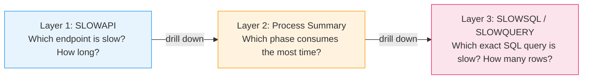

# Phase 1.1 — Logging System: The Foundation of Discovery

## Why Logging Matters

You can't fix what you can't see. Without structured logging, performance problems stay invisible — you know the pipeline "feels slow" but not **which endpoint**, **which phase**, or **which SQL query** is the offender. Logs capture context at the moment the problem occurs, so you can diagnose it after the fact.

---

## Our Logging System: 3-Layer Observability Stack

We built a layered system where each layer gives progressively more detail. **Start from Layer 1 (coarsest) and drill down** — this avoids information overload and focuses your investigation.



| Layer | What it measures | Granularity | Key Log Prefix | Config Setting |
|-------|-----------------|-------------|----------------|----------------|
| 1 — HTTP | Endpoint wall-clock time | Per HTTP request | `API:` / `SLOWAPI:` | `EnablePerformanceLogging`, `PerformanceLoggingForSlowHttpAPIThresholdMs` |
| 2 — Phase | Workflow stage breakdown | Per engine/phase | `APISUMMARY:` / `SQLSUMMARY:` / `LOADDBSUMMARY:` etc. | Always on when Layer 1 is on |
| 3 — SQL | Individual query timing | Per SQL statement | `SLOW QUERY` / `SLOWSQL:` | `EnablePerformanceLogging`, `PerformanceLoggingForSlowQueryThresholdMs` |

**How they link together:** All three layers share a `CorrelationId`, so you can trace from a slow HTTP endpoint → which workflow phase consumed the time → which specific SQL query within that phase was the offender:

```
[CorrelationId:25eb3d1b] API: GET /v1/api/device/search → 200 in 5200 ms
[CorrelationId:25eb3d1b] APISUMMARY: TotalDuration=5200ms, TotalSqlCount=47, TotalSqlDuration=4850ms
[CorrelationId:25eb3d1b][EF-Reader][ThreadId:3][Duration:4850.25ms] SLOW QUERY
    SELECT [Extent1].[DeviceName], ...
    FROM [dbo].[Device] AS [Extent1]
    LEFT OUTER JOIN ...
    WHERE [Extent1].[DeviceName] IN (...)
```

In this example, Layer 1 told us the endpoint took 5,200 ms. Layer 2 told us SQL consumed 4,850 ms of that (93%). Layer 3 told us it was a single query with a LEFT OUTER JOIN. That's enough to start Phase 2.

---

## Layer 1 — HTTP Request Duration Logging (SLOWAPI)

The `RequestDurationLoggingMiddleware` wraps every HTTP request with a `Stopwatch` and logs duration, status, param counts, and return counts. The `CollectionCountFilter` automatically counts collection sizes in parameters and return values — so you immediately see *how much data flows through each endpoint*.

### Log examples

**Normal request (below threshold):**
```
API invocation GET /v1/api/device/search completed with status code 200 in 342 ms [Params: filters:2, Return: 48]
```

**Slow request (above threshold):**
```
SLOWAPI: GET /v1/api/datacenters/ExampleDC/deviceultra → 200 in 91191 ms [Params: datacenter:1, Return: 1801] (threshold: 5000 ms)
```

### Our real example

When we first enabled SLOWAPI logging with a 5,000ms threshold against a large datacenter:
```
SLOWAPI: GET /v1/api/datacenters/ExampleDC/deviceultra → 200 in 91191 ms [Return: 1801]
SLOWAPI: POST /v1/api/device/search → 200 in 148234 ms [Params: deviceNames:1801, Return: 1801]
```
A 200 OK was hiding a 2.5-minute query. The `[Return: 1801]` showed 1,801 devices — a reasonable count. The problem wasn't *what* it returned but *how long it took*.

### Source Code: RequestDurationLoggingMiddleware

This ASP.NET Core middleware wraps every request with timing and conditional logging:

```csharp
public class RequestDurationLoggingMiddleware : IMiddleware
{
    private readonly ILogger<RequestDurationLoggingMiddleware> _logger;
    private readonly AppConfig _config;

    public RequestDurationLoggingMiddleware(
        ILogger<RequestDurationLoggingMiddleware> logger, AppConfig config)
    {
        _logger = logger;
        _config = config;
    }

    public async Task InvokeAsync(HttpContext context, RequestDelegate next)
    {
        if (!_config.EnablePerformanceLogging)
        {
            await next(context);
            return;
        }

        // Generate correlation ID for tracking related logs (API + SQL queries)
        var correlationId = Guid.NewGuid().ToString();
        PerformanceLoggingContext.RequestCorrelationId.Value = correlationId;

        Stopwatch stopwatch = Stopwatch.StartNew();
        int statusCode = 0;

        try
        {
            await next(context);
            statusCode = context.Response.StatusCode;
        }
        finally
        {
            stopwatch.Stop();
            var elapsed = stopwatch.ElapsedMilliseconds;

            // Record request in workflow-level metrics
            PerformanceLoggingContext.RequestMetrics.RecordRequest(
                context.Request.Method, context.Request.Path, statusCode, elapsed);

            var isSlow = elapsed >= _config.PerformanceLoggingForSlowHttpAPIThresholdMs;
            var shouldLog = _config.EnableVerboseHttpLogging || isSlow;

            if (shouldLog)
            {
                // Retrieve element counts set by CollectionCountFilter
                context.Items.TryGetValue("ParameterElementCount", out var paramCountObj);
                context.Items.TryGetValue("ReturnElementCount", out var returnCountObj);
                paramCountObj ??= 0;
                returnCountObj ??= 0;

                if (isSlow)
                {
                    _logger.LogWarning(
                        "[{CorrelationId}] SLOWAPI: {Method} {Path} → {StatusCode} in {Elapsed} ms " +
                        "[Params: {ParamCount}, Return: {ReturnCount}] (threshold: {Threshold} ms)",
                        correlationId, context.Request.Method, context.Request.Path,
                        statusCode, elapsed, paramCountObj, returnCountObj,
                        _config.PerformanceLoggingForSlowHttpAPIThresholdMs);
                }
                else
                {
                    _logger.LogInformation(
                        "[{CorrelationId}] API: {Method} {Path} → {StatusCode} in {Elapsed} ms " +
                        "[Params: {ParamCount}, Return: {ReturnCount}]",
                        correlationId, context.Request.Method, context.Request.Path,
                        statusCode, elapsed, paramCountObj, returnCountObj);
                }
            }

            PerformanceLoggingContext.RequestCorrelationId.Value = null;
        }
    }
}
```

### Source Code: CollectionCountFilter

An ASP.NET Core action filter that automatically counts collection sizes in parameters and return values, then stashes the counts into `HttpContext.Items` for the middleware to log:

```csharp
public class CollectionCountFilter : IActionFilter
{
    private readonly ILogger<CollectionCountFilter> _logger;

    public CollectionCountFilter(ILogger<CollectionCountFilter> logger) => _logger = logger;

    public void OnActionExecuting(ActionExecutingContext context)
    {
        try
        {
            var paramCounts = new List<string>();
            foreach (var kvp in context.ActionArguments)
            {
                int count = kvp.Value switch
                {
                    ICollection col => col.Count,
                    _ => 1
                };
                paramCounts.Add($"{kvp.Key}:{count}");
            }
            if (paramCounts.Count > 0)
                context.HttpContext.Items["ParameterElementCount"] = string.Join(",", paramCounts);
        }
        catch (Exception ex)
        {
            _logger.LogWarning(ex, "Error counting parameters in CollectionCountFilter");
        }
    }

    public void OnActionExecuted(ActionExecutedContext context)
    {
        try
        {
            if (context.Result is ObjectResult { Value: not null } result)
            {
                int? returnCount = result.Value switch
                {
                    ICollection col => col.Count,
                    not string => 1,
                    _ => null
                };
                if (returnCount.HasValue)
                    context.HttpContext.Items["ReturnElementCount"] = returnCount.Value;
            }
        }
        catch (Exception ex)
        {
            _logger.LogWarning(ex, "Error counting return value in CollectionCountFilter");
        }
    }
}
```

### Configuration

```ini
# Performance logging master switch
EnablePerformanceLogging=true

# Slow query threshold in milliseconds (default: 100ms)
PerformanceLoggingForSlowQueryThresholdMs=150

# Slow HTTP API threshold in milliseconds (default: 100ms)
PerformanceLoggingForSlowHttpAPIThresholdMs=150

# Verbose HTTP logging - logs all requests, not just slow ones (default: false)
EnableVerboseHttpLogging=false

# Verbose SQL logging - logs detailed SQL scripts (default: false, high overhead)
EnableVerboseSqlLogging=false
```

### Registration

```csharp
// In DependencyRegistrar.cs — register the filter globally
builder.Services.AddControllers(options =>
{
    options.Filters.Add<CollectionCountFilter>();
});
```

---

## Layer 2 — Workflow Phase Logging (Process Summary)

Layer 1 tells you *which endpoint* is slow. Layer 2 breaks the endpoint into workflow phases (`CLEARDB`, `LOADETL`, `LOADFILE`, `LOADDB`, `DUMPDB`, `DUMPFILE`) and measures each independently using `PerformanceLoggingContext`, so you see which phase dominates.

### Log examples

```
APISUMMARY:    TotalDuration=396832ms (6:37), APICalls=2327, SQLQueries=3717, SQLDuration=184500ms
CLEARDBSUMMARY:  Duration=949ms    (0.2%)
LOADETLSUMMARY:  Duration=487ms    (0.1%)
LOADFILESUMMARY: Duration=32877ms  (8.3%)
LOADDBSUMMARY:   Duration=199464ms (50.3%)  ← BOTTLENECK
DUMPDBSUMMARY:   Duration=77874ms  (19.6%)
DUMPFILESUMMARY: Duration=132013ms (33.3%)
BUSINESSREQUESTSUMMARY: Duration=53168ms (13.4%)  = unaccounted overhead
```

**Key insight:** `LOADDBSUMMARY` at 50.3% immediately pointed us to the database loading phase. The gap between `LOADDBSUMMARY` (199s) and `SQLSUMMARY` (184.5s) was only 15s — almost all LOADDB time was SQL execution, not C# processing.

### Source Code: PerformanceLoggingContext

The unified context that manages query and request metrics across layers:

```csharp
/// <summary>
/// Unified performance logging context that manages query and optional request metrics.
/// In local mode: Only QueryMetrics is present.
/// In remote mode: Both QueryMetrics and RequestMetrics are available.
/// </summary>
public static class PerformanceLoggingContext
{
    private static QueryMetricsContext _queryMetrics;
    private static RequestMetricsContext _requestMetrics;
    private static bool _initialized = false;

    /// <summary>
    /// AsyncLocal storage for per-request correlation ID.
    /// Thread-safe and flows across async boundaries.
    /// </summary>
    public static readonly AsyncLocal<string> RequestCorrelationId = new AsyncLocal<string>();

    public static QueryMetricsContext QueryMetrics
    {
        get
        {
            if (!_initialized)
                throw new InvalidOperationException(
                    "PerformanceLoggingContext not initialized. Call Initialize() at startup.");
            return _queryMetrics;
        }
    }

    public static RequestMetricsContext RequestMetrics
    {
        get
        {
            if (!_initialized)
                throw new InvalidOperationException(
                    "PerformanceLoggingContext not initialized. Call Initialize() at startup.");
            return _requestMetrics;
        }
    }

    /// <summary>
    /// Initialize at application startup. Must be called once.
    /// </summary>
    /// <param name="enableRequestTracking">True for API mode, false for library mode.</param>
    public static void Initialize(bool enableRequestTracking = false)
    {
        if (_initialized) throw new InvalidOperationException("Already initialized.");
        _queryMetrics = new QueryMetricsContext();
        _requestMetrics = new RequestMetricsContext();
        _initialized = true;
    }
}
```

---

## Layer 3 — EF SQL Interceptor (SLOWSQL)

The `EFLoggingInterceptor` (implementing `IDbCommandInterceptor`) wraps every EF SQL command with a `Stopwatch` and logs slow queries with the full SQL text, row count, duration, and thread context. Errors are always logged regardless of threshold.

### Log examples

**Slow query (above threshold):**
```
[EF-Reader][ThreadId:3][Duration:4850.25ms] SLOW QUERY
    SELECT [Extent1].[DeviceName], [Extent1].[Asn], [Extent1].[Sku], ...
    FROM [dbo].[Device] AS [Extent1]
    LEFT OUTER JOIN [dbo].[DeviceTemplate] AS [Extent2] ON ...
    WHERE [Extent1].[DeviceName] IN (@p0, @p1, @p2, ...)
    [Return: 177444]
```

**SQL error (always logged):**
```
[EF-Reader][ThreadId:5][Duration:30000ms] SQL ERROR: SqlException: The query processor ran out of internal resources
    SELECT ... WHERE DeviceName IN (@p0, @p1, ... @p2100, ...)
```

### Our real example

This single log entry revealed the root cause of our performance problem:

```
[EF-Reader][ThreadId:3][Duration:148234ms] SLOW QUERY
    SELECT [UnionAll1].[DeviceName], ... (50+ columns)
    FROM (
      SELECT ... FROM [Device] LEFT OUTER JOIN [DeviceTemplate] ...
      UNION ALL
      SELECT ... FROM [Device] LEFT OUTER JOIN [DeviceMetadata] ...
    ) AS [UnionAll1]
    [Return: 177444]
```

- **148,234ms** — a 2.5-minute query
- **UNION ALL + LEFT OUTER JOIN** — classic join explosion pattern
- **[Return: 177,444]** — expected 1,801 devices, got 98× more rows due to JOIN cartesian products
- Pointed directly to anti-patterns S1 (Join Explosion), S4 (Over-Projection), and S5 (Monolithic Query)

### Source Code: EFLoggingInterceptor

The full interceptor implementation. Key design decisions:
- Uses `ConcurrentDictionary` to track concurrent query timings safely
- Only logs slow queries (above threshold) or errors — avoids log noise
- Records all queries in workflow-level metrics regardless of threshold
- Uses `AsyncLocal<string>` correlation IDs flowing from HTTP middleware

```csharp
/// <summary>
/// Entity Framework SQL logging interceptor with execution timing.
/// Logs only slow queries (exceeding threshold) or queries with errors.
/// </summary>
public class EFLoggingInterceptor : IDbCommandInterceptor
{
    private readonly ILogger logger;
    private readonly ConcurrentDictionary<string, CommandTimingInfo> commandTimings
        = new ConcurrentDictionary<string, CommandTimingInfo>();

    /// <summary>
    /// Slow query threshold in milliseconds. Default: 1000ms.
    /// </summary>
    private readonly double slowQueryThresholdMs;

    public EFLoggingInterceptor(ILogger logger, double slowQueryThresholdMs = 1000)
    {
        this.logger = logger;
        this.slowQueryThresholdMs = slowQueryThresholdMs;
    }

    // --- IDbCommandInterceptor interface ---
    // Each pair (Executing/Executed) delegates to StartTiming/StopTiming.

    public void ReaderExecuting(DbCommand command,
        DbCommandInterceptionContext<DbDataReader> ctx)
        => StartTiming(command, ctx, "Reader");

    public void ReaderExecuted(DbCommand command,
        DbCommandInterceptionContext<DbDataReader> ctx)
        => StopTiming(command, ctx, "Reader");

    // (NonQuery and Scalar follow the same pattern)

    private void StartTiming<TResult>(DbCommand command,
        DbCommandInterceptionContext<TResult> ctx, string type)
    {
        var stopwatch = Stopwatch.StartNew();

        // Flows from HTTP middleware via AsyncLocal
        var correlationId = PerformanceLoggingContext.RequestCorrelationId.Value
            ?? Guid.NewGuid().ToString();

        var timingInfo = new CommandTimingInfo
        {
            Stopwatch = stopwatch,
            CommandText = command.CommandText,
            CommandType = type,
            CorrelationId = correlationId
        };

        commandTimings.TryAdd(correlationId, timingInfo);
        ctx.SetUserState("CorrelationId", correlationId);
    }

    private void StopTiming<TResult>(DbCommand command,
        DbCommandInterceptionContext<TResult> ctx, string type)
    {
        var correlationId = ctx.FindUserState("CorrelationId") as string;
        if (correlationId == null) return;

        if (!commandTimings.TryRemove(correlationId, out var timingInfo)) return;

        timingInfo.Stopwatch.Stop();
        var elapsedMs = timingInfo.Stopwatch.Elapsed.TotalMilliseconds;

        // Always record in workflow-level metrics (even for fast queries)
        PerformanceLoggingContext.QueryMetrics.RecordQuery(
            type, (long)elapsedMs, command.CommandText, ctx.Exception != null);

        if (ctx.Exception != null)
        {
            // Always log errors
            logger.LogError("[{CorrelationId}][EF-{Type}][Duration:{Elapsed}ms] SQL ERROR: {Sql}",
                correlationId, type, elapsedMs, command.CommandText);
        }
        else if (elapsedMs >= slowQueryThresholdMs)
        {
            // Log slow queries only
            logger.LogWarning(
                "[{CorrelationId}][EF-{Type}][Duration:{Elapsed}ms] SLOW QUERY " +
                "(threshold: {Threshold}ms): {Sql}",
                correlationId, type, elapsedMs, slowQueryThresholdMs,
                command.CommandText);
        }
        // Fast, successful queries are NOT logged but ARE recorded in metrics
    }
}
```

---

## Putting It All Together: The 3-Layer Discovery Walkthrough

Here's the complete flow of how the three layers work together during a real investigation:

### Step 1: Layer 1 flags the slow endpoint

```
SLOWAPI: POST /v1/api/device/search → 200 in 148234 ms [Params: deviceNames:1801, Return: 1801]
```
**Conclusion:** Device search with 1,801 device names takes 148 seconds. That's our target.

### Step 2: Layer 2 shows which phase is the bottleneck

```
APISUMMARY: TotalDuration=396832ms, SQLQueries=3717, SQLDuration=184500ms
LOADDBSUMMARY: Duration=199464ms (50.3%)  ← BOTTLENECK
```
**Conclusion:** 50% of time is in database loading. SQL accounts for 184.5s of the 199s LOADDB phase — the problem is in SQL queries, not C# processing.

### Step 3: Layer 3 identifies the specific query

```
[EF-Reader][Duration:148234ms] SLOW QUERY
    SELECT ... 50+ columns ... UNION ALL ... LEFT OUTER JOIN (5 tables)
    [Return: 177444]
```
**Conclusion:** One query takes 148s and returns 177,444 rows for 1,801 devices = 98× row explosion from JOIN. Root cause identified — proceed to Phase 2.

**Total time from "it's slow" to "I know why":** Under 5 minutes with the logs in hand.

---

**→ Next: [Benchmarking](02_Benchmarking.md)**
**← Back to [Phase 1 — Discover](README.md)**
**← Back to [Index](../README.md)**
