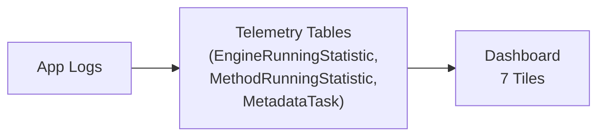

# Phase 1.3 — Dashboard: Visualized Performance System

## Why Dashboards Matter

Logs are great for investigation, but you have to know there's a problem before you look. A dashboard shows performance trends **continuously** — you notice regressions as they emerge, not after a user complains. Before dashboards, we discovered the DeviceUltra problem from a user complaint. After dashboards, we caught the next regression (22% duration increase from verbose SQL logging) from a dashboard tile — before any user was affected.

---

## Dashboard Architecture

The dashboard requires the 3-layer logging system (Phase 1.1) to feed structured data into a telemetry store. Without that, there's nothing to visualize.



---

## Dashboard Tiles

Each tile answers one question. Here's what we built:

| Tile | Type | Question It Answers |
|------|------|--------------------|
| **1. Version Trend** | Line chart | Is the new version faster or slower? (P50/P99 by version) |
| **2. Top Costly Buildouts** | Bar chart | Which DCs consume the most time? |
| **3. Engine Breakdown** | Stacked bar | Which engine dominates pipeline time? |
| **4. Method Heatmap** | Table | Which C# methods are slowest? (top 25 by duration) |
| **5. SQL Query Stats** | Table | Too many queries (N+1) or too-slow queries (join explosion)? |
| **6. Error Rate** | Line chart | Are SqlExceptions or timeouts increasing? |
| **7. Row Count Ratio** | Gauge | Is any query returning >5× expected rows? |

---

## Telemetry Collection Source Code

The telemetry pipeline starts with collecting engine-level statistics during pipeline execution. Here's the data model and collector:

### EngineRunningStatistic — Data Model

```csharp
/// <summary>
/// Entity representing pipeline engine running information.
/// </summary>
public class EngineRunningStatistic
{
    /// <summary>
    /// Per-engine statistic info (keyed by "DC-Engine-SeedId").
    /// </summary>
    public ConcurrentDictionary<string, EngineStatic> EngineResults { get; set; }
        = new ConcurrentDictionary<string, EngineStatic>(StringComparer.OrdinalIgnoreCase);

    /// <summary>
    /// Per-method statistic info (keyed by "DC-Engine-SeedId-Method-Type-ErrorCode").
    /// </summary>
    public ConcurrentDictionary<string, MethodStatic> MethodStaticResults { get; set; }
        = new ConcurrentDictionary<string, MethodStatic>(StringComparer.OrdinalIgnoreCase);
}
```

### EngineStatisticCollector — Collection Logic

The collector aggregates timing data during pipeline execution using `ConcurrentDictionary.AddOrUpdate` for thread safety:

```csharp
public class EngineStatisticCollector : IEngineStatisticCollector
{
    private EngineRunningStatistic engineRunningStatistic;
    private ConcurrentDictionary<string, EngineStatic> EngineStaticResults;
    private ConcurrentDictionary<string, MethodStatic> MethodStaticResults;

    public EngineStatisticCollector(ILogger<EngineStatisticCollector> logger)
    {
        this.engineRunningStatistic = new EngineRunningStatistic();
        this.EngineStaticResults = this.engineRunningStatistic.EngineResults;
        this.MethodStaticResults = this.engineRunningStatistic.MethodStaticResults;
    }

    /// <summary>
    /// Record a method invocation's duration and result type.
    /// Uses AddOrUpdate to safely accumulate from multiple threads.
    /// </summary>
    public void AddMethodStatic(SeedInfo seedInfo, string methodName,
        TimeSpan duration, StaticType messageType,
        string errorCode = default, string errorShortName = default)
    {
        string engineKey = $"{seedInfo.DcFolderName}-{seedInfo.EngineName}-{seedInfo.SeedId}";
        string methodKey = $"{engineKey}-{methodName}-{messageType}-{errorCode}";

        var engineResult = this.EngineStaticResults.GetOrAdd(engineKey,
            key => new EngineStatic
            {
                DcFolderName = seedInfo.DcFolderName,
                EngineName = seedInfo.EngineName,
                SeedId = seedInfo.SeedId,
                // ... other seed metadata
            });

        // Thread-safe accumulation of method-level metrics
        engineResult.MethodStaticPair.AddOrUpdate(methodKey,
            key => new MethodStatic
            {
                MethodName = methodName,
                StaticType = messageType,
                InvokeTimes = 1,
                TotalDuration = duration,
                ErrorCode = errorCode,
            },
            (key, existing) =>
            {
                existing.InvokeTimes += 1;
                existing.TotalDuration += duration;
                return existing;
            });
    }

    /// <summary>
    /// Record engine-level operation statistics (duration, deletes, updates).
    /// </summary>
    public void AddEngineStatic(SeedInfo seedInfo,
        EngineOperationStatistic operationStatistic)
    {
        string engineKey = $"{seedInfo.DcFolderName}-{seedInfo.EngineName}-{seedInfo.SeedId}";
        this.EngineStaticResults.AddOrUpdate(engineKey,
            key => new EngineStatic
            {
                DcFolderName = seedInfo.DcFolderName,
                EngineName = seedInfo.EngineName,
                SeedId = seedInfo.SeedId,
                TotalDuration = operationStatistic.Duration,
                InvokeTimes = 1,
                DeleteCount = operationStatistic.DeleteCount,
                UpdateCount = operationStatistic.UpdateCount,
            },
            (key, existing) =>
            {
                existing.TotalDuration += operationStatistic.Duration;
                existing.InvokeTimes += 1;
                existing.DeleteCount += operationStatistic.DeleteCount;
                existing.UpdateCount += operationStatistic.UpdateCount;
                return existing;
            });
    }
}
```

---

## Adding New Tiles

Performance tuning is iterative — new bottlenecks surface as old ones are fixed. To add a tile: define the metric → write the KQL query → choose the visual (line for trends, bar for comparisons, table for detail) → set alert thresholds → pin to dashboard.

---

**→ Next: [Advanced Diagnostic Tools](04_Advanced_Diagnostic_Tools.md)**
**← Back to [Benchmarking](02_Benchmarking.md)**
**← Back to [Phase 1 — Discover](README.md)**
