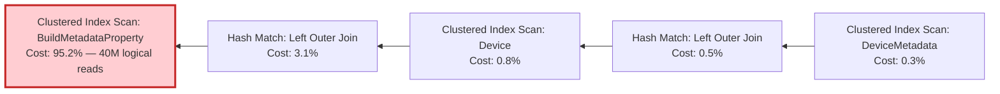

# Phase 1.4 — Advanced Diagnostic Tools

Logs and dashboards show **what** is slow. These tools show **why** — at the SQL engine level.

---

## Tool Comparison

| Tool | Overhead | Best For | Production Safe? |
|------|----------|----------|-----------------|
| **SSMS Execution Plan** (`Ctrl+M`) | Low | Ad-hoc investigation of a known slow query | Yes |
| **SET STATISTICS IO / TIME** | Low | Logical reads and CPU per table | Yes |
| **DMV Queries** (`sys.dm_exec_*`) | None | Top-N queries, missing indexes | Yes |
| **Query Store** (`sys.query_store_*`) | Low (~1-3%) | Regression detection, plan history | Yes (if enabled) |
| **SQL Profiler** | High (10-15%) | Capturing EF-generated SQL in real time | **No** — dev/test only |
| **Extended Events** | Low (1-3%) | Production-grade SQL capture | Yes |

---

## 1. SSMS Execution Plan (5-Minute Check)

Paste the slow SQL from your EF log into SSMS, press `Ctrl+M` + `F5`, and read the plan.

**Quick steps:** `SET STATISTICS IO ON` → paste query → `Ctrl+M` → `F5` → check Messages tab for I/O → check Execution Plan tab for operators.

**Key operators to watch:**

| Operator | Severity | Meaning |
|----------|----------|---------|
| Clustered Index **Scan** | Critical | Full table scan — missing index or function on column |
| Index **Seek** | Good | Targeted lookup — no action needed |
| Key Lookup | Warning | Add `INCLUDE` columns to the index |
| Hash Match | Warning | Expensive join — consider splitting the query |

**Our real example** — device filter query execution plan:



95.2% cost was a full scan on BuildMetadataProperty caused by `.ToLower()` wrapping the join column.

---

## 2. DMV Queries (Zero-Overhead Discovery)

DMVs query SQL Server's internal performance counters — free, always available, production-safe.

| DMV Query | Purpose |
|-----------|---------|
| Top-N slowest queries | `sys.dm_exec_query_stats` — find queries with highest avg elapsed time |
| Missing index recommendations | `sys.dm_db_missing_index_*` — SQL Server's own index suggestions with impact scores |
| Index usage stats | `sys.dm_db_index_usage_stats` — check if indexes are being seeked or scanned |
| Index fragmentation | `sys.dm_db_index_physical_stats` — >30% = rebuild, 10-30% = reorganize |
| Table sizes | `sys.tables` + `sys.allocation_units` — largest tables = highest scan cost |

### Example: Top-N Slowest Queries

```sql
SELECT TOP 10
    qs.total_elapsed_time / qs.execution_count AS avg_elapsed_time_us,
    qs.execution_count,
    SUBSTRING(st.text, (qs.statement_start_offset/2) + 1,
        ((CASE qs.statement_end_offset
            WHEN -1 THEN DATALENGTH(st.text)
            ELSE qs.statement_end_offset END
        - qs.statement_start_offset) / 2) + 1) AS query_text
FROM sys.dm_exec_query_stats AS qs
CROSS APPLY sys.dm_exec_sql_text(qs.sql_handle) AS st
ORDER BY avg_elapsed_time_us DESC;
```

### Example: Missing Index Recommendations

```sql
SELECT
    migs.avg_total_user_cost * migs.avg_user_impact *
        (migs.user_seeks + migs.user_scans) AS ImpactScore,
    mid.statement AS TableName,
    mid.equality_columns,
    mid.inequality_columns,
    mid.included_columns
FROM sys.dm_db_missing_index_groups AS mig
INNER JOIN sys.dm_db_missing_index_group_stats AS migs
    ON mig.index_group_handle = migs.group_handle
INNER JOIN sys.dm_db_missing_index_details AS mid
    ON mig.index_handle = mid.index_handle
ORDER BY ImpactScore DESC;
```

---

## 3. SQL Profiler & Extended Events

| | SQL Profiler | Extended Events |
|---|---|---|
| Overhead | 10-15% | 1-3% |
| Use in | Dev/test only | Production-safe |
| Captures | Full SQL text + timing + plan | Same, lower overhead |

Use Profiler to see exact EF-generated SQL. Use Extended Events in production.

> **→** Step-by-step: [SQL Profiler Guide](04a_SQL_Profiler_Guide.md)

---

## 4. Query Store (Regression Detection)

SQL Server's built-in "flight recorder" — automatically tracks query plans, duration, CPU, and logical reads over time. Detects when a plan change causes regression.

**Enable Query Store:**
```sql
ALTER DATABASE [YourDatabase]
SET QUERY_STORE = ON
(OPERATION_MODE = READ_WRITE,
 MAX_STORAGE_SIZE_MB = 1000,
 INTERVAL_LENGTH_MINUTES = 30);
```

**Detect regressions:**
```sql
SELECT
    qsp.plan_id,
    qsrs.avg_duration,
    qsrs.avg_logical_io_reads,
    qst.query_sql_text
FROM sys.query_store_plan AS qsp
JOIN sys.query_store_runtime_stats AS qsrs
    ON qsp.plan_id = qsrs.plan_id
JOIN sys.query_store_query AS qsq
    ON qsp.query_id = qsq.query_id
JOIN sys.query_store_query_text AS qst
    ON qsq.query_text_id = qst.query_text_id
ORDER BY qsrs.avg_duration DESC;
```

---

**→ Next: [Prioritization](05_Prioritization.md)**
**← Back to [Dashboard](03_Dashboard.md)**
**← Back to [Phase 1 — Discover](README.md)**
