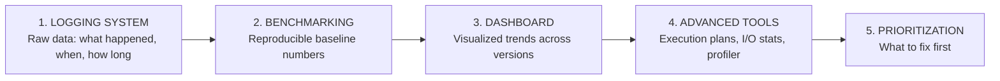

# Phase 1 — Discover: Find the Performance Problem

**Goal:** Surface slow queries, endpoints, and system bottlenecks *before* users complain — using the observability infrastructure we've built into the system.

> **Principle:** You can't fix what you can't see. The first investment is always in logging and measurement.

---

## Why Discovery Matters

Performance problems are invisible by default. Without deliberate observability, you only learn about them when users complain — or worse, when a production incident forces a crisis response.

Consider what happened to us: a device filter query was taking **148 seconds** per call, but because it was called inside a batch pipeline, no single user saw a timeout — the pipeline just quietly took 14 minutes instead of 1. Nobody knew it was a problem until we looked at the numbers. The query had been generating **40 million logical reads** (311 GB of I/O) on every call, silently burning server resources for months.

Discovery is the practice of making these hidden costs **visible, measurable, and prioritized** — so you fix the right thing first.

---

## How Discovery Works: The 5-Part System

We've organized discovery into five capabilities, each on its own page. They build on each other:

| Part | Page | What You'll Learn |
|------|------|-------------------|
| **1 — Logging System** | [01_Logging_System.md](01_Logging_System.md) | Our 3-layer observability stack: HTTP middleware (SLOWAPI), workflow phase summaries, and EF SQL interceptor. How each layer helps, what data it produces, real log examples from our system. |
| **2 — Benchmarking** | [02_Benchmarking.md](02_Benchmarking.md) | How to establish reproducible baselines under controlled conditions. The methodology we used, templates, and real baseline numbers from our optimization journey. |
| **3 — Dashboard** | [03_Dashboard.md](03_Dashboard.md) | Building a visualized performance system from log data. Dashboard architecture, recommended tiles, KQL queries, and how to add new tiles as new bottlenecks are discovered. |
| **4 — Advanced Diagnostic Tools** | [04_Advanced_Diagnostic_Tools.md](04_Advanced_Diagnostic_Tools.md) | SSMS execution plans, DMV queries, Extended Events, Query Store — for when logs point you to a suspicious query and you need to understand *exactly* why it's slow. |
| | [04a_SQL_Profiler_Guide.md](04a_SQL_Profiler_Guide.md) | *(sub-page)* Step-by-step SQL Server Profiler tutorial for capturing EF-generated SQL. |
| **5 — Prioritization** | [05_Prioritization.md](05_Prioritization.md) | Impact scoring formula, priority matrix, and how we ranked our own slow queries to decide what to fix first. |

---

## The Discovery Flow in Practice

Here's how we actually used these tools to discover the performance problem:

| Step | Tool Used | What We Found |
|------|-----------|---------------|
| 1 | **SLOWAPI middleware** | `GET /deviceultra/{dc}` taking 91,191 ms — flagged automatically |
| 2 | **Phase summary logging** | `LOADDBSUMMARY` consuming 50.3% of total pipeline time |
| 3 | **EF SLOWSQL interceptor** | One query returning 177,444 rows for 1,801 expected devices — 98× row explosion |
| 4 | **Benchmark baseline** | Captured: 148,234 ms wall-clock, 40.8M logical reads, Clustered Index Scan at 95.2% plan cost |
| 5 | **SSMS execution plan** | Confirmed: 5-table JOIN with no covering indexes, functions on indexed columns |
| 6 | **Dashboard** | Showed the problem was consistent across all regions and getting worse as data grew |
| 7 | **Prioritization** | Impact score of 33.3B — P0 critical, fixed immediately |

Each discovery tool gave us a different lens on the same problem. Together, they told the full story.

---

## Output of Phase 1

After completing Phase 1, you should have:

- [ ] Logging enabled at appropriate thresholds (see [Logging System](01_Logging_System.md))
- [ ] Baseline numbers captured for the current state (see [Benchmarking](02_Benchmarking.md))
- [ ] Dashboard tiles showing latency trends (see [Dashboard](03_Dashboard.md))
- [ ] Deep diagnostic data for suspicious queries (see [Advanced Tools](04_Advanced_Diagnostic_Tools.md))
- [ ] A ranked list of slow queries/endpoints with impact scores (see [Prioritization](05_Prioritization.md))
- [ ] The top 1–3 candidates selected for Phase 2 (Diagnose & Fix)

---

**→ Next: [Phase 2 — Diagnose & Fix](../Phase2_Diagnose_and_Fix/README.md)**
**→ Checklist: [Performance Process Checklist](../Checklist.md)**
**← Back to [Index](../README.md)**
