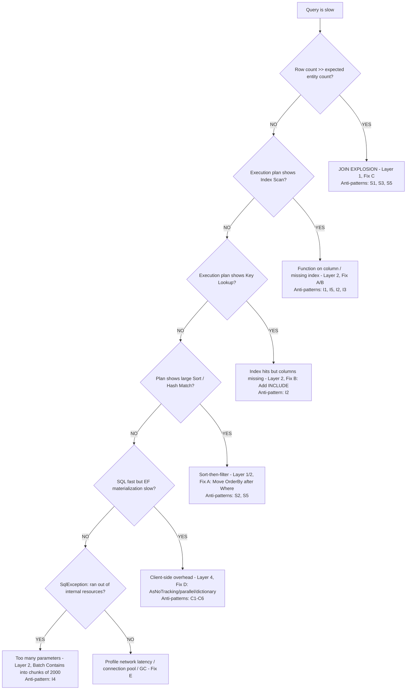

# Diagnostic Decision Tree

> **Part of [Phase 2 — Diagnose & Fix](README.md)**

Use this tree to map a slow query to the correct fix category.

---

---

## How to Use

1. Start with "[Query is slow]" and answer each question using data from Phase 1
2. The leaf node tells you which **Layer**, **Fix category**, and **Anti-pattern IDs** apply
3. Go to the corresponding Fix page (A–E) for the solution

---

**← Back to [Phase 2 Overview](README.md)**
