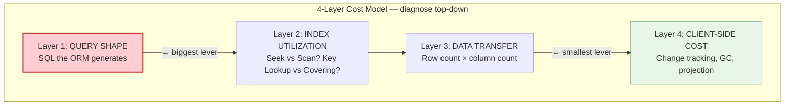

# Phase 2 — Diagnose & Fix

**Goal:** Given a slow query surfaced in Phase 1, determine *why* it is slow and apply the right fix.

> **Principle:** Diagnose top-down through cost layers. The fix is the natural result of the diagnosis.

---

## Phase 2 Contents

| Page | What You'll Find |
|------|------------------|
| **This page** | 4-layer cost model, diagnostic workflow, anti-pattern catalog, fix hierarchy |
| [Decision Tree](01a_Decision_Tree.md) | Visual flowchart to map symptoms → fix category |
| [Fix A — Index-Killing Patterns](02_Fix_A_Index_Killing_Patterns.md) | Remove `.ToLower()`, date functions — cheapest fix, 10-20× impact |
| [Fix B — Indexes](03_Fix_B_Indexes.md) | Covering, composite, filtered indexes |
| [Fix C — Query Architecture](04_Fix_C_Query_Architecture.md) | Split monolithic JOINs → batch + dictionary assembly (10-900×) |
| [Fix D — Client-Side](05_Fix_D_Client_Side.md) | `.AsNoTracking()`, parallel, `HashSet`, batching (15-50%) |
| [Fix E — System Tuning](06_Fix_E_System_Tuning.md) | Server GC, logging gates, algorithm complexity (10-25%) |
| [Checklist](Checklist_Phase2.md) | Phase 2 checklist |

---

## 1. The 4-Layer Cost Model

Every ORM query has **four cost layers**. Diagnose top-down — earlier layers dominate:

---

## 2. Diagnostic Workflow

| # | Step | What to look for |
|---|------|------------------|
| 1 | Capture baseline numbers | Wall-clock duration, row count |
| 2 | Get actual execution plan | Scan vs Seek, Hash Match vs Nested Loop |
| 3 | Get I/O stats | Logical reads per table — high reads = missing/wrong index |
| 4 | Check row count ratio | Returned / expected — >5× = join explosion (Layer 1) |
| 5 | Inspect generated SQL | Functions on columns? Missing WHERE? Wide SELECT? |
| 6 | Map to anti-pattern | Assign ID (S1, I2, C1…) → fix is clear |

---

## 3. Anti-Pattern Quick Reference

### Query Shape (S)

| ID | Anti-Pattern | Symptom | Fix |
|----|-------------|---------|-----|
| S1 | Join Explosion | Rows 10-100× expected | [Fix C](04_Fix_C_Query_Architecture.md) |
| S2 | Sort-then-Filter | Large Sort on full table | [Fix A](02_Fix_A_Index_Killing_Patterns.md) |
| S3 | Eager Loading Everything | NULL-padded rows | [Fix C](04_Fix_C_Query_Architecture.md) |
| S4 | Over-Projection (SELECT *) | Wide result set | [Fix B](03_Fix_B_Indexes.md) |
| S5 | Monolithic Deferred Query | Hash Match everywhere | [Fix C](04_Fix_C_Query_Architecture.md) |

### Index & Predicate (I)

| ID | Anti-Pattern | Symptom | Fix |
|----|-------------|---------|-----|
| I1 | Function on Column | Scan instead of Seek | [Fix A](02_Fix_A_Index_Killing_Patterns.md) |
| I2 | Missing Covering Index | Seek + Key Lookup | [Fix B](03_Fix_B_Indexes.md) |
| I3 | Wrong Composite Key Order | Scan on composite | [Fix B](03_Fix_B_Indexes.md) |
| I4 | Unbounded IN (>2100) | SqlException | [Fix D](05_Fix_D_Client_Side.md) |
| I5 | Date Function in Predicate | Full scan on date | [Fix A](02_Fix_A_Index_Killing_Patterns.md) |

### ORM / Client-Side (C)

| ID | Anti-Pattern | Symptom | Fix |
|----|-------------|---------|-----|
| C1 | Tracked Read-Only Query | High CPU/GC | [Fix D](05_Fix_D_Client_Side.md) |
| C2 | N+1 Query Loop | Hundreds of small SQLs | [Fix D](05_Fix_D_Client_Side.md) |
| C3 | Double ToList().ToCollection() | Extra allocation | [Fix D](05_Fix_D_Client_Side.md) |
| C4 | Unordered Sub-Collections | Diff noise | [Fix D](05_Fix_D_Client_Side.md) |
| C5 | Synchronous DB Calls | Thread starvation | [Fix D](05_Fix_D_Client_Side.md) |
| C6 | No Capacity Hint | GC spikes | [Fix D](05_Fix_D_Client_Side.md) |

### Cross-Cutting (X)

| ID | Anti-Pattern | Symptom | Fix |
|----|-------------|---------|-----|
| X1 | No Early Exit | Unnecessary DB round-trip | [Fix D](05_Fix_D_Client_Side.md) |
| X2 | No Batching Strategy | Crashes at prod scale | [Fix D](05_Fix_D_Client_Side.md) |
| X3 | Debug Logging in Hot Path | CPU serialization | [Fix E](06_Fix_E_System_Tuning.md) |
| X4 | No Telemetry | Silent regressions | [Phase 1 logging](../Phase1_Discover/01_Logging_System.md) |

---

## 4. Fix Impact Hierarchy

Apply fixes in this order — the first 1-2 categories usually resolve 95%+ of the problem.

| Priority | Fix Category | Typical Impact | Page |
|----------|-------------|----------------|------|
| 1 | **A — Remove index killers** | 10-20× | [Fix A](02_Fix_A_Index_Killing_Patterns.md) |
| 2 | **B — Add covering indexes** | 2-10× | [Fix B](03_Fix_B_Indexes.md) |
| 3 | **C — Reshape query architecture** | 10-900× | [Fix C](04_Fix_C_Query_Architecture.md) |
| 4 | **D — Client-side optimization** | 15-50% | [Fix D](05_Fix_D_Client_Side.md) |
| 5 | **E — System-level tuning** | 10-25% | [Fix E](06_Fix_E_System_Tuning.md) |

---

**← Back to [Index](../README.md)**
**→ Next: [Fix A — Index-Killing Patterns](02_Fix_A_Index_Killing_Patterns.md)**
**→ Skip to: [Phase 3 — Validate & Monitor](../Phase3_Validate_and_Monitor/README.md)**
