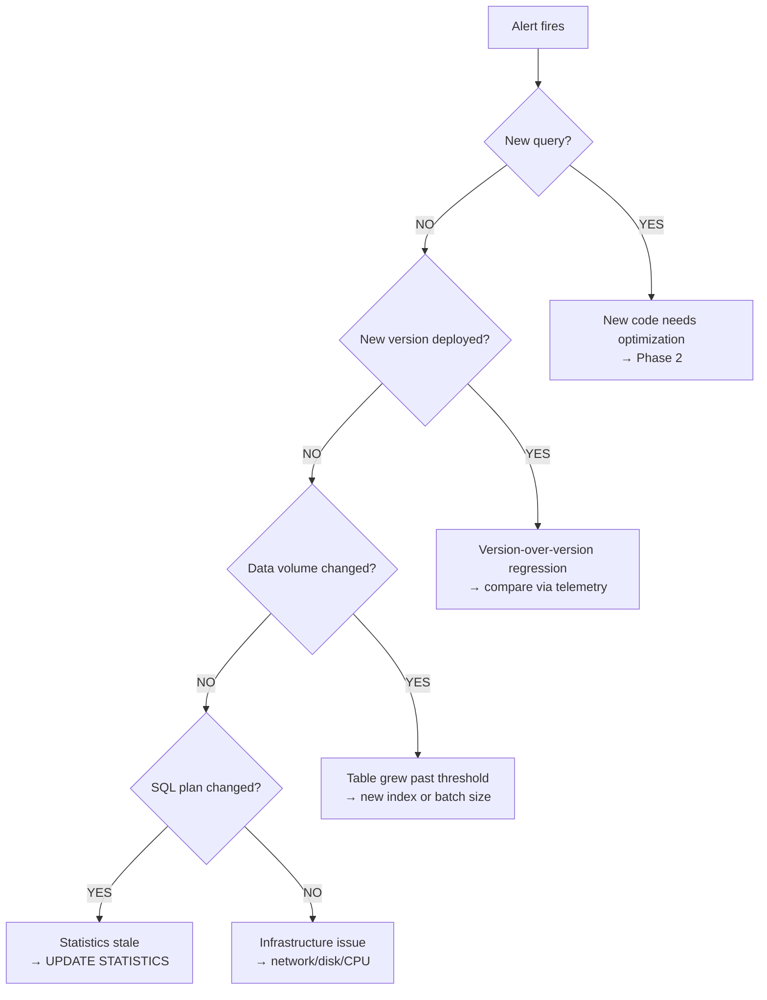

# Monitoring: Guarding Against Regression

> **Part of [Phase 3 — Validate & Monitor](README.md)**

---

## Why Monitoring Is Needed

After deployment, performance can regress due to new code paths, data growth, query plan changes, configuration drift, or dependency upgrades.

---

## What to Monitor

| Signal | Where | Alert Threshold |
|--------|-------|-----------------|
| Endpoint latency P99 | SLOWAPI log / telemetry | > 500 ms |
| Query duration P99 | EF SLOWSQL log / telemetry | > 200 ms |
| Row count from SQL | EF log `[Return: N]` | > 5× expected |
| SQL query count per request | SQLSUMMARY log | > 50 (N+1 pattern) |
| Error rate | Application logs / telemetry | Any SqlException > 0 |
| Engine duration trend | `EngineRunningStatistic` table | > 20% increase vs prior version |
| GC pressure | .NET event counters | Gen2 > 10/run or pause > 500ms |

---

## Dashboard Tiles

| Tile | Type | Regression Signal |
|------|------|-------------------|
| Version Trend | Line chart | P50/P99 goes up after deployment |
| Top Costly Buildouts | Bar chart | New DC appears at top |
| Engine Breakdown | Stacked bar | One engine suddenly dominates |
| Method Heatmap | Table | New method in top 10 |
| SQL Query Stats | Table | Avg query time increases |
| Error Rate | Line chart | Non-zero spike |
| Row Count Ratio | Gauge | > 5× = investigate |

---

## Alerts

| Alert | Condition | Severity | Action |
|-------|-----------|----------|--------|
| High latency | P99 > 500% of baseline | Critical | Investigate immediately |
| Moderate latency | P99 > 150% of baseline | Warning | Review in standup |
| Error spike | SqlException > 0 in 1h | Critical | Parameter limit or timeout |
| Row explosion | Rows > 5× expected | Warning | JOIN added by new code |
| New slow query | SLOWSQL > 5000ms (unseen) | Warning | New code needs optimization |
| GC pressure | Gen2 > 10/run or pause > 500ms | Warning | Memory allocation regression |

### Investigation Flowchart

---

**← Back to [Phase 3 Overview](README.md)**
**→ Next: [Index Health Monitoring](03_Index_Health.md)**
