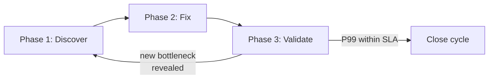

# The Iterative Loop in Practice

> **Part of [Phase 3 — Validate & Monitor](README.md)**

Performance tuning is never "done." Fixing one bottleneck reveals the next one.

---

## The Cycle

Each fix shifts the bottleneck. In our journey:

1. **Iteration 1:** Fixed `.ToLower()` — 148s → 10s (Fix A)
2. **Iteration 2:** Split monolithic JOIN — 10s → 162ms (Fix C)
3. **Iteration 3:** Added `.AsNoTracking()` + batch loading — 162ms → ~120ms (Fix D)
4. **Iteration 4:** Server GC + logging gate — ~120ms → ~100ms (Fix E)
5. **Iteration 5:** Applied same patterns to DeviceUltra endpoint — 91s → ~1.8s

---

## When to Stop

| Continue | Close |
|----------|-------|
| P99 still above SLA | P99 within SLA |
| Clear next bottleneck identified | Marginal gains < 10% per fix |
| Data growing — proactive fix needed | Bottleneck shifted to different service |
| Quick win available (< 1 day) | Major rewrite for < 5% gain |

## When to Restart

- Data grows — tables double in size, old fixes become insufficient
- New features add queries — monitoring catches a new slow query
- Alert fires — P99 regression detected by dashboard

---

## Keeping Docs Updated

After each iteration:

1. Update before/after comparison — add new row to version history
2. Record which anti-patterns were fixed (tag with IDs: S1, I2, C1, etc.)
3. Update dashboard — add tiles for new metrics
4. Archive raw data — execution plans, I/O stats, profiler traces
5. Update Phase 1 baseline — "after" becomes "before" for next investigation

---

**← Back to [Phase 3 Overview](README.md)**
**← Back to [Index](../README.md)**
