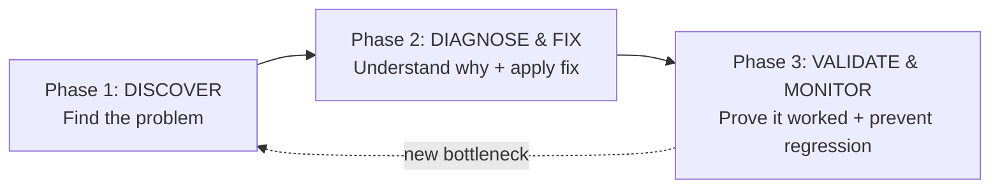

# Performance Tuning DB-Zeroing Handbook

A complete, battle-tested methodology for finding and fixing database performance problems in .NET + Entity Framework applications.

This handbook documents the full journey of taking an EF6 application from **148-second queries to sub-second responses** — a 900× improvement — through systematic logging, diagnosis, and targeted fixes.

---

## Who This Is For

- **.NET developers** working with Entity Framework (EF6 or EF Core)
- **Backend engineers** optimizing SQL Server-backed APIs
- **Tech leads** building performance culture in their teams

---

## The Three Phases

| Phase | What You'll Learn | Key Outcome |
|-------|-------------------|-------------|
| [**Phase 1 — Discover**](Phase1_Discover/README.md) | 3-layer logging, benchmarking, dashboards, diagnostic tools, prioritization | Ranked list of slow queries with root cause hypotheses |
| [**Phase 2 — Diagnose & Fix**](Phase2_Diagnose_and_Fix/README.md) | 4-layer cost model, anti-pattern catalog (20 patterns), fix hierarchy (A→E) | Query reshaped, indexes added, client-side optimized |
| [**Phase 3 — Validate & Monitor**](Phase3_Validate_and_Monitor/README.md) | Before/after comparison, output diffing, regression monitoring | Measurable improvement proven, dashboard guarding against regression |

---

## Quick Navigation

### Phase 1 — Discover
- [Overview](Phase1_Discover/README.md)
- [Logging System (3-layer observability)](Phase1_Discover/01_Logging_System.md)
- [Benchmarking](Phase1_Discover/02_Benchmarking.md)
- [Dashboard](Phase1_Discover/03_Dashboard.md)
- [Advanced Diagnostic Tools](Phase1_Discover/04_Advanced_Diagnostic_Tools.md)
- [SQL Profiler Guide](Phase1_Discover/04a_SQL_Profiler_Guide.md)
- [Prioritization](Phase1_Discover/05_Prioritization.md)
- [Phase 1 Checklist](Phase1_Discover/Checklist_Phase1.md)

### Phase 2 — Diagnose & Fix
- [Overview & Anti-Pattern Catalog](Phase2_Diagnose_and_Fix/README.md)
- [Decision Tree](Phase2_Diagnose_and_Fix/01a_Decision_Tree.md)
- [Fix A — Index-Killing Patterns](Phase2_Diagnose_and_Fix/02_Fix_A_Index_Killing_Patterns.md)
- [Fix B — Indexes](Phase2_Diagnose_and_Fix/03_Fix_B_Indexes.md)
- [Fix C — Query Architecture](Phase2_Diagnose_and_Fix/04_Fix_C_Query_Architecture.md)
- [Fix D — Client-Side Optimization](Phase2_Diagnose_and_Fix/05_Fix_D_Client_Side.md)
- [Fix E — System-Level Tuning](Phase2_Diagnose_and_Fix/06_Fix_E_System_Tuning.md)
- [Phase 2 Checklist](Phase2_Diagnose_and_Fix/Checklist_Phase2.md)

### Phase 3 — Validate & Monitor
- [Overview](Phase3_Validate_and_Monitor/README.md)
- [Validation](Phase3_Validate_and_Monitor/01_Validation.md)
- [Monitoring](Phase3_Validate_and_Monitor/02_Monitoring.md)
- [Index Health](Phase3_Validate_and_Monitor/03_Index_Health.md)
- [The Iterative Loop](Phase3_Validate_and_Monitor/04_Iterative_Loop.md)
- [Phase 3 Checklist](Phase3_Validate_and_Monitor/Checklist_Phase3.md)

### Reference
- [General Checklist](Checklist.md)

---

## Key Results

| Optimization | Before | After | Improvement |
|-------------|--------|-------|-------------|
| Device filter query | 148,234 ms | 162 ms | **915×** |
| DeviceUltra endpoint | 91,191 ms | ~1,800 ms | **~50×** |
| Row count (filter query) | 177,444 | 1,801 | **98× fewer** |
| Logical reads (filter query) | 40.8M pages (311 GB) | ~5,000 pages | **8,000× fewer** |

---

## How to Use This Handbook

1. **Start with the [Checklist](Checklist.md)** for a high-level overview of all steps
2. **Follow the phases in order** — Phase 1 produces the inputs for Phase 2, which produces the inputs for Phase 3
3. **Use the decision tree** in Phase 2 to quickly map symptoms to fixes
4. **Copy the templates** — benchmark template, before/after comparison template, validation checklist
5. **Iterate** — fixing one bottleneck reveals the next; loop back to Phase 1

---

*This handbook is based on real production optimization work on a .NET + EF6 + SQL Server REST API. All code examples are sanitized but functionally accurate.*
